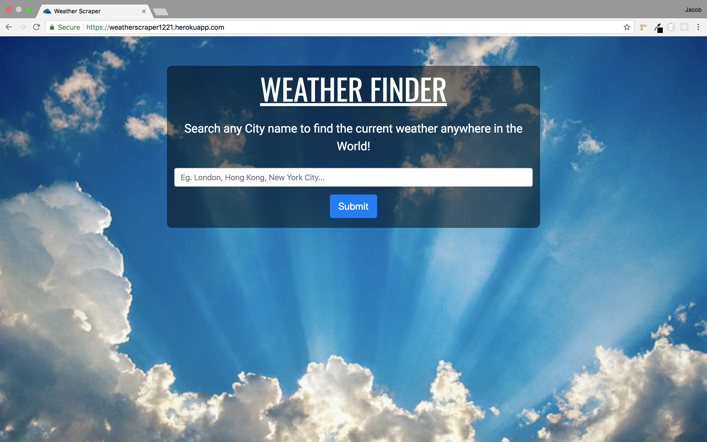
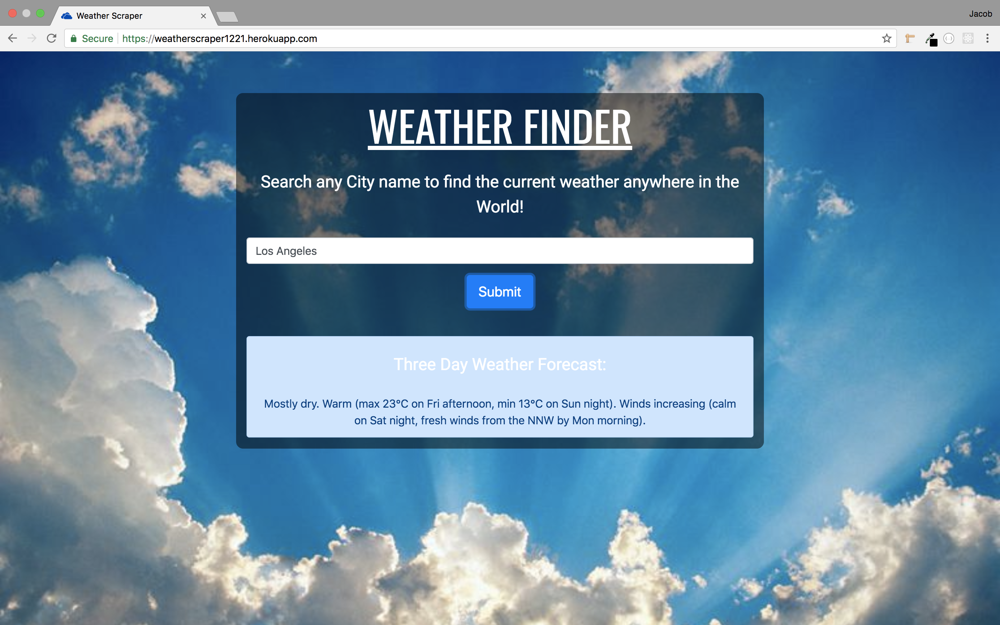
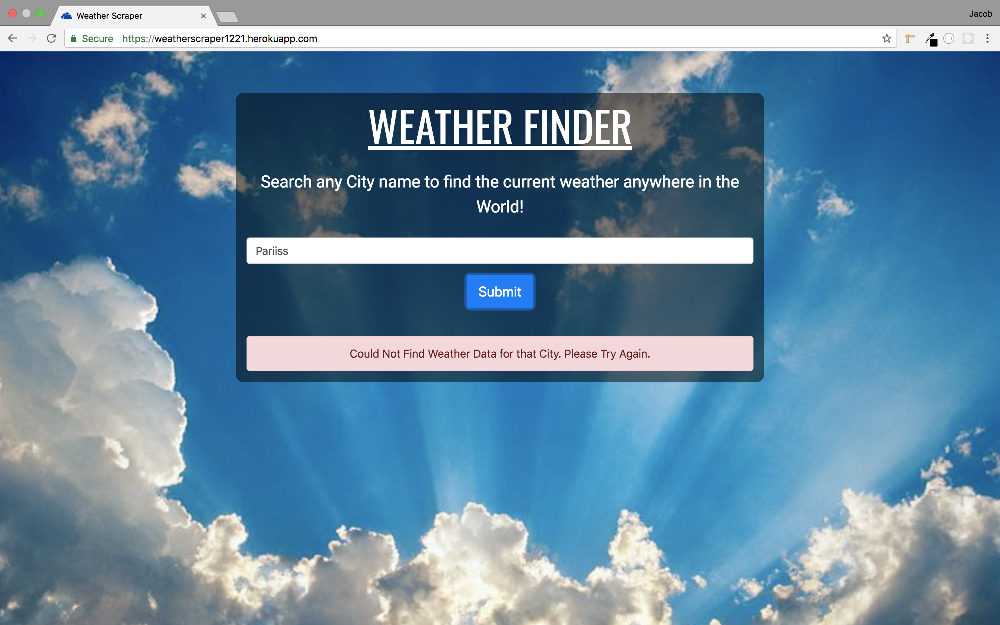

# Weather-Scraper
I made this app to practice some basic backend coding with PHP. The app is built with HTML, CSS, Bootstrap, JavaScript, jQuery, AJAX, and PHP. On this web app the user can search for the 3 day weather forecast of any city in the world. This is accomplished by using PHP and Regex to use the value of the user's form input entry to search a site for the weather and scrape the 3 day forecast. Then the data is added to an alert on the page using jQuery and AJAX.

---

- This is the first thing the user will see when the app loads. There is the app name "Weather Finder" and brief instructions for what to do. There is a form text input for the user to enter a city name and a simple submit button.

- Once the user enters a city to search for the app will display the 3 Day Forecast for that city in a Bootstrap alert underneath the search form. This example uses the city of Los Angeles.

- Here is another example using the city of Chattanooga, Tennessee

